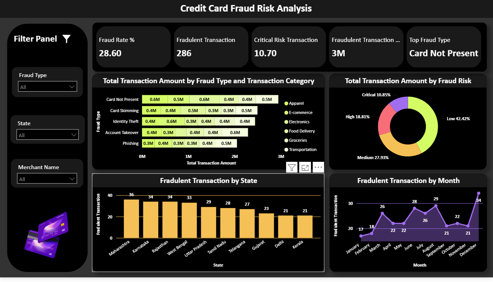

# 💳 Credit Card Fraud Risk Analysis Dashboard

**An Interactive Power BI Dashboard for Fraud Detection, Risk Assessment & Business Intelligence**

<p align="center">


</p>

**Turning transactional data into actionable fraud intelligence through interactive analytics.**

---

## 📸 Dashboard Preview

> Replace the image path after uploading the screenshot to your repository.

<p align="center">

</p>

---

# 📑 Table of Contents

- Project Overview
- Business Problem
- Objectives
- Dashboard Highlights
- Key Performance Indicators
- Dashboard Walkthrough
- Business Insights
- Recommendations
- Tech Stack
- Data Preparation
- Repository Structure
- Future Improvements
- Learning Outcomes
- Author

---

# 📌 Project Overview

Credit card fraud continues to be one of the biggest challenges for banks, payment gateways, and financial institutions. As digital transactions continue to grow, organizations require efficient tools to detect suspicious activities, identify high-risk transactions, and monitor fraud trends before they result in financial loss.

This project presents a **Credit Card Fraud Risk Analysis Dashboard** developed in **Microsoft Power BI** to transform raw transactional data into meaningful business insights. The dashboard provides a centralized view of fraud-related metrics, enabling analysts and decision-makers to monitor fraud rates, identify geographical hotspots, evaluate transaction risks, and analyze fraud patterns across multiple dimensions.

The report combines interactive visualizations, KPI cards, slicers, and dynamic filtering to simplify fraud analysis and support data-driven decision-making.

---

# 💼 Business Problem

Financial institutions process thousands of transactions every day, making manual fraud detection both time-consuming and inefficient.

The primary challenges include:

- Identifying fraudulent transactions quickly
- Understanding fraud trends over time
- Monitoring fraud across different states
- Evaluating fraud severity
- Identifying the most common fraud types
- Prioritizing investigations based on risk levels

This dashboard addresses these challenges through interactive business intelligence and visual analytics.

---

# 🎯 Project Objectives

- Analyze fraudulent credit card transactions.
- Measure the overall fraud rate.
- Identify the most common fraud types.
- Monitor monthly fraud trends.
- Compare fraudulent transactions across states.
- Categorize fraud according to risk levels.
- Provide interactive filtering for deeper analysis.
- Support business decisions using visual insights.

---

# 📊 Dashboard Highlights

The dashboard consists of multiple interactive components designed to simplify fraud analysis.

### 📈 KPI Cards

| KPI | Value |
|------|-------|
| Fraud Rate | **28.60%** |
| Fraudulent Transactions | **286** |
| Critical Risk Transactions | **10.70%** |
| Fraudulent Transaction Amount | **₹3 Million** |
| Top Fraud Type | **Card Not Present** |

---

### 📊 Visualizations Included

✔ Stacked Bar Chart

- Transaction Amount by Fraud Type
- Transaction Category Comparison

✔ Donut Chart

- Fraud Risk Distribution

✔ Column Chart

- Fraudulent Transactions by State

✔ Line Chart

- Monthly Fraud Trend Analysis

✔ Interactive Filters

- Fraud Type
- State
- Merchant Name

---

# 📈 Dashboard Walkthrough

## 1️⃣ KPI Summary

The KPI section provides a quick overview of fraud-related statistics, allowing users to understand the current fraud scenario without exploring the detailed charts.

It highlights:

- Overall fraud rate
- Number of fraudulent transactions
- Critical risk percentage
- Total fraudulent transaction amount
- Most common fraud type

---

## 2️⃣ Fraud Type Analysis

The stacked bar chart compares transaction amounts across different fraud types and transaction categories.

The dashboard identifies multiple fraud categories including:

- Card Not Present
- Card Skimming
- Identity Theft
- Account Takeover
- Phishing

This visualization helps understand which fraud types contribute the highest transaction amounts and which business categories are more vulnerable.

---

## 3️⃣ Fraud Risk Distribution

Fraudulent transactions are categorized into four different risk levels.

| Risk Level | Percentage |
|------------|-----------:|
| Low | **42.42%** |
| Medium | **27.93%** |
| High | **18.81%** |
| Critical | **10.85%** |

This segmentation helps prioritize fraud investigations based on severity.

---

## 4️⃣ Geographic Analysis

The dashboard compares fraudulent transactions across multiple Indian states.

Top observed states include:

| State | Fraud Cases |
|--------|------------:|
| Maharashtra | **36** |
| Karnataka | **34** |
| Rajasthan | **34** |
| West Bengal | **33** |
| Uttar Pradesh | **29** |

This visualization enables geographical fraud monitoring and resource allocation.

---

## 5️⃣ Monthly Trend Analysis

The line chart illustrates how fraud activity changes throughout the year.

Observations from the dashboard show:

- Fraud remained relatively consistent during the first half of the year.
- Noticeable increases occurred during mid-year.
- The highest number of fraudulent transactions occurred in **December (34)**.

Trend analysis helps identify seasonal fraud spikes.

---

# 🔍 Key Business Insights

Based on the dashboard analysis, several important insights emerge:

### 💳 Card Not Present Fraud Dominates

The dashboard identifies **Card Not Present** as the most common fraud type, indicating that online and remote transactions remain the primary fraud target.

---

### ⚠ Significant Fraud Rate

Approximately **28.60%** of analyzed transactions were fraudulent, highlighting the importance of continuous monitoring and fraud prevention.

---

### 📍 Geographic Fraud Concentration

Maharashtra recorded the highest number of fraudulent transactions, followed closely by Karnataka and Rajasthan, suggesting higher fraud activity in these regions.

---

### 📈 Seasonal Increase

Fraud activity increased toward the end of the year, with December recording the highest fraud count.

This pattern may indicate seasonal shopping behavior or increased online transaction volumes.

---

### 🚨 Risk Prioritization

Although Critical Risk transactions account for only **10.85%**, they should receive immediate attention because of their potential financial impact.

---

### 🛒 Transaction Categories

Transaction amounts vary significantly across business categories such as:

- Apparel
- Electronics
- E-commerce
- Food Delivery
- Groceries
- Transportation

This indicates that fraud behavior differs depending on merchant category.

---

# 💡 Business Recommendations

Based on the analysis, organizations should consider:

- Implement stronger authentication for Card Not Present transactions.
- Increase fraud monitoring during high-risk months.
- Deploy additional fraud detection mechanisms in high-risk states.
- Prioritize investigation of Critical Risk transactions.
- Continuously monitor merchant-level fraud patterns.
- Implement machine learning models for real-time fraud prediction.
- Regularly update fraud detection rules based on evolving transaction behavior.

---

# 🛠 Tech Stack

| Technology | Purpose |
|------------|----------|
| Microsoft Power BI | Dashboard Development |
| Power Query | Data Cleaning |
| DAX | KPI & Measure Creation |
| Data Modeling | Relationship Management |
| Interactive Visualizations | Business Reporting |

---

# 🧹 Data Preparation

The dataset underwent several preprocessing steps before visualization:

- Data Cleaning
- Missing Value Handling
- Data Type Conversion
- Relationship Creation
- DAX Measure Development
- KPI Calculation
- Interactive Filtering

---

# 📂 Repository Structure

```
Credit-Card-Fraud-Risk-Analysis
│
├── Credit Card Fraud Analysis.pbix
├── README.md
├── images
│   └── dashboard.png
└── Dataset
```

---

# 🚀 Future Improvements

Potential enhancements include:

- Real-time transaction monitoring
- Machine Learning fraud prediction
- SQL Server integration
- Automated Power BI refresh
- Customer segmentation analysis
- Fraud forecasting
- Drill-through investigation pages
- Mobile-optimized dashboard

---

# 🎓 Learning Outcomes

This project strengthened my understanding of:

- Business Intelligence
- Data Visualization
- Interactive Dashboard Design
- Power BI Development
- Power Query
- DAX Measures
- KPI Design
- Data Modeling
- Business Storytelling
- Fraud Analytics

---

# 👨‍💻 Author

## Rohit More

**Aspiring Data Analyst | Power BI Developer | Business Intelligence Enthusiast**

If you found this project interesting, consider giving it a ⭐ on GitHub.

Let's connect and build data-driven solutions together!

---

<div align="center">

## ⭐ If you like this project, please consider starring the repository!

**Turning Data into Decisions with Power BI**

</div>
